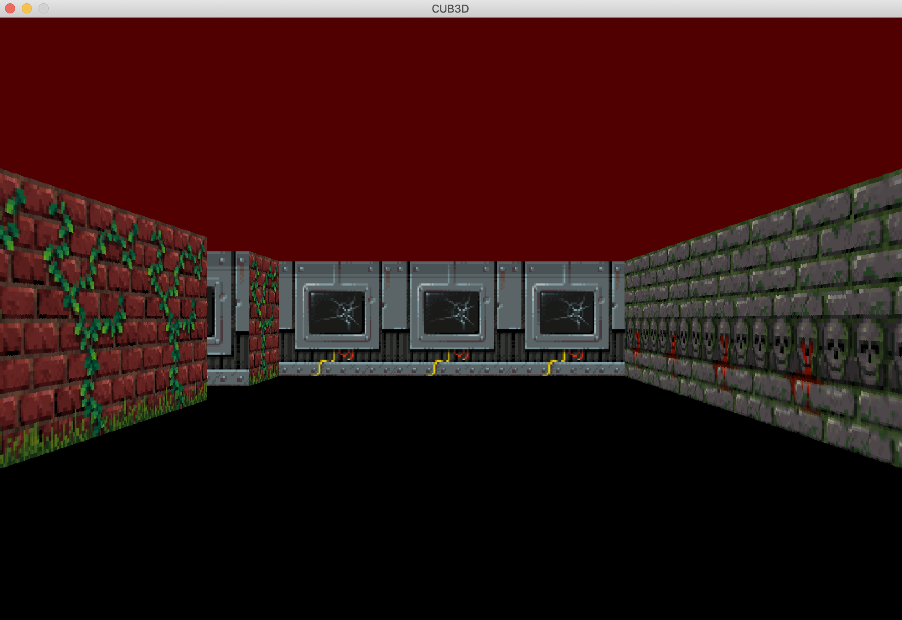

<h1 align="center">
	🔫 42-Cub3d
</h1>

<p align="center">
	
	
	
	
</p>

<h3 align="center">
  	<a href="#-about-the-project">About</a>
	<span> · </span>
	<a href="#-raycasting">Raycasting</a>
	<span> · </span>
	<a href="#-running-the-game">Running</a>
	<span> · </span>
	<a href="#-configurating-the-map">Configuration</a>
	<span> · </span>
  	<a href="#-key-and-features">Keys and features</a>
</h3>

# 💡 About the project
> My first RayCaster with miniLibX

This project is inspired by the world-famous Wolfenstein 3D game, which
was the first FPS ever. It will enable you to explore ray-casting. Your goal will be to
make a dynamic view inside a maze, in which you’ll have to find your way.

<p align="center">
	
</p>

## ⚡ Raycasting
>`Raycasting` simulates a 3D environment by casting rays from the player’s viewpoint to detect objects and walls. It calculates the distance and angle of each ray to render a corresponding vertical slice, creating the illusion of depth and perspective.
<p align="center">
	
</p>

## 🚀 Running the game
🌟We use personnaly the [MLX42](https://github.com/codam-coding-college/MLX42)🌟
### Linux  (you need Xlaunch or [equivalent](https://github.com/codam-coding-college/MLX42?tab=readme-ov-file#for-windows-with-windows-subsystem-for-linux-2-wsl2) if you are in wsl on windows ❗)
```bash
sudo cmake MLX42 -B MLX42/build; cd MLX42/build; sudo make; cd ../..; sudo apt-get install mpg123
make run
```
### MacOS  (You need to use [brew](https://github.com/codam-coding-college/MLX42?tab=readme-ov-file#for-macos))
```bash
make run
```
This will launch the previously compiled project with `make` and execute it.
(The map file must be a [valid](https://github.com/MVPee/42-Cub3d/edit/main/README.md#-configurating-the-map) `.cub` map)

## 💻 Configurating the map

</br>It will allow you to setup the following parameters :
- `NO` -- define the north texture
- `SO` -- define the south texture
- `WE` -- define the west texture
- `EA` -- define the east texture
- `DO` -- define the door texture
- `F` -- define the floor color (rgb)
- `C` -- define the ceiling color (rgb)
```
NO ./rsrcs/sprites/walls/flower.png
SO ./rsrcs/sprites/walls/iron2.png
WE ./rsrcs/sprites/walls/brick4.png
EA ./rsrcs/sprites/walls/red_brick.png
DO ./rsrcs/sprites/doors/iron_door.png

F  0,0,0
C  80, 0, 0
```
> Then you can put a valid map

A valid map has one `player`, all `floors` and `doors` (0/D) are surrounded by `walls` (1)
```
        1111111111111111111111111
        1000000000110000000000001
        1011000001110000000000001
        1001000000000000000000001
111111111011000001110000000000001
10000010001100000111D111111111111
111101 111111101110001001000111111
111101111111110111011 10D000DDDDDD1
1100000011010101110001001000111111
10000000000000001100000010001
10000000000000001101010010001
11000001110101011111011110N0111   111
11110111 1110101 101111010001     101
11111111 1111111 111111111111     111
```
------------
## 📜 Key and features

- **W A S D**
  -- Used to move the player

- **MOUSE / RIGHT LEFT**
  -- Used to change the direction of the player

- **ESPACE**
  -- Used to fire

- **ESCAPE / RED CROSS**
  -- Quit the program cleany

- **DOOR**
  -- Door can be open and close

- **MINIMAP**
  -- Minimap follow the player and rotate in 360°

- **WALL COLLISION**
  -- You can't walk through a wall

- **SPRITES**
  -- Animated sprites

- **MUSIC**
  -- Handsome ambient music

- **SOUND**
  -- Handsome sound when fire

---
This group project was done by [MVPee (mvan-pee)](https://github.com/MVPee) and [Nour Echaara (nechaara)](https://github.com/noureh10)
